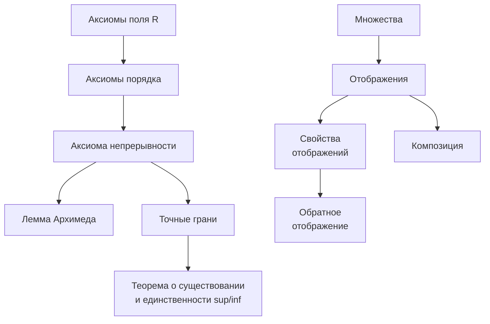
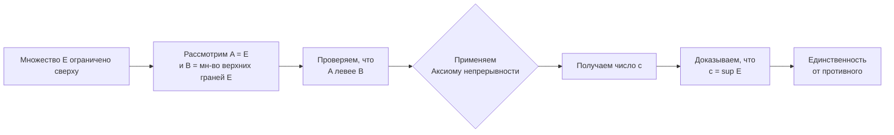

Этот конспект закладывает основу всего математического анализа. Мы строим мост от интуитивных представлений о числах к строгой математической структуре, используя формулировку аксиомы непрерывности.

---

#### **1. Действительные числа: аксиоматический подход**

Мы все интуитивно знакомы с вещественными числами (числовая прямая). Но математике нужна строгая основа. Мы определяем множество **R** (действительные числа) как множество, удовлетворяющее трем группам аксиом.

**1.1. Аксиомы поля (как числа складываются и умножаются)**
Существуют операции сложения $+$ и умножения $*$, такие что для любых $a, b, c ∈ R$:
*   **А1.** $a + b = b + a$ (коммутативность сложения)
*   **А2.** $(a + b) + c = a + (b + c)$ (ассоциативность сложения)
*   **А3.** Существует **0** (ноль): $a + 0 = a$ для любого $a$.
*   **А4.** Для любого $a$ существует $-a$ (противоположный элемент): $a + (-a) = 0$.
*   **М1.** $a * b = b * a$ (коммутативность умножения)
*   **М2.** $(a * b) * c = a * (b * c)$ (ассоциативность умножения)
*   **М3.** Существует **1** (единица), $1 ≠ 0$: $a * 1 = a$ для любого $a$.
*   **М4.** Для любого $a ≠ 0$ существует $a⁻¹$ (обратный элемент): $a * a⁻¹ = 1$.
*   **Д.** $a * (b + c) = a * b + a * c$ (дистрибутивность).

*🔍 Интуиция:* Эти аксиомы описывают привычные правила арифметики. Они работают и для рациональных чисел **Q**. Значит, нам нужно что-то еще, чтобы отличить **R** от **Q**.

**1.2. Аксиомы порядка (как числа сравниваются)**
Существует отношение $<$ (меньше), которое для любых $a, b, c ∈ R$:
*   **О1.** Либо $a < b$, либо $b < a$, либо $a = b$ (трихотомия).
*   **О2.** Если $a < b$ и $b < c$, то $a < c$ (транзитивность).
*   **О3.** Если $a < b$, то $a + c < b + c$ (согласованность со сложением).
*   **О4.** Если $a < b$ и $0 < c$, то $a * c < b * c$ (согласованность с умножением).

*🔍 Интуиция:* Порядок позволяет расположить числа на прямой. Множество **Q** тоже упорядочено. Нам все еще не хватает главного.

**1.3. Аксиома непрерывности (полноты)**
Это ключевая аксиома, которая отличает **R** от **Q**. Она гласит, что числовая прямая не имеет «дырок».

*   **Формально:** Пусть $A$ и $B$ – непустые подмножества **R**. Будем говорить, что **$A$ располагается левее $B$**, если для любых $a ∈ A$ и $b ∈ B$ выполняется неравенство $a ≤ b$.
    Тогда аксиома непрерывности утверждает:
    $\forall A, B \subset \mathbb{R}, A \neq \varnothing, B \neq \varnothing: (A \text{ располагается левее } B) \Rightarrow \exists c \in \mathbb{R}: a \leq c \leq b, \quad \forall a \in A, \forall b \ B$.
    То есть, между любыми двумя непустыми множествами, одно из которых лежит левее другого, существует число $c$, их разделяющее.

*🔍 Интуиция:* Если одно множество лежит целиком слева от другого, то между ними нельзя втиснуть "дырку"; всегда найдется число, заполняющее промежуток. Эта аксиома гарантирует полноту вещественной прямой.

---

#### **2. Важное следствие: Лемма Архимеда**

Прежде чем перейти к точным граням, докажем фундаментальный факт, который часто используется в анализе.

**Лемма (Архимеда):** Для любого вещественного числа $x ∈ R$ существует натуральное число $n ∈ N$ такое, что $n > x$.

**Доказательство (от противного):**
1.  **Логическая схема доказательства:**

2.  **Доказательство:**
    Предположим, что лемма неверна. Тогда существует такое число $x ∈ R$, что для всех натуральных $n ∈ N$ выполняется $n ≤ x$. Это означает, что множество натуральных чисел **N** ограничено сверху.
    Рассмотрим два множества:
    *   $A = N$ (все натуральные числа).
    *   $B = \{ y ∈ R : y > n \quad \forall n ∈ N \}$ (все числа, большие любого натурального).

    Оба множества непусты ($1 ∈ A$, $x + 1 ∈ B$ по нашему предположению). Кроме того, $A$ располагается левее $B$ по построению: любое натуральное $n$ меньше любого $y ∈ B$ (иначе, если бы нашлось $y ∈ B$ и $n ∈ N$ такие, что $y ≤ n$, то $y$ не могло бы быть больше всех натуральных чисел).

    Применим аксиому непрерывности. Существует число $c ∈ R$ такое, что:
    $n \leq c \leq y \quad \forall n \in \mathbb{N}, \forall y \in B.$
    Рассмотрим число $c - 1$. Так как $c - 1 < c$, то $c - 1$ не может быть верхней границей для $A$ (потому что $c$ — наименьшая из верхних границ, как следует из неравенства $c ≤ y$ для всех $y ∈ B$). Значит, существует натуральное число $m ∈ N$ такое, что $m > c - 1$. Но тогда $m + 1 > c$. Однако $m + 1$ — натуральное число, значит, $m + 1 ∈ A$. Получаем, что элемент множества $A$ оказался больше $c$, что противоречит условию $n ≤ c$ для всех $n ∈ A$.
    Следовательно, наше предположение неверно, и лемма Архимеда доказана. ∎

*🔍 Интуиция:* Какое бы большое число вы ни назвали, всегда найдется натуральное число, которое его больше. Это кажется очевидным, но строго следует из аксиомы непрерывности.

---

#### **3. Точные верхняя и нижняя грани**

Пусть $E ⊂ R$ — некоторое числовое множество.

*   **Определение:** Число $M ∈ R$ называется **верхней гранью** множества $E$, если для любого $x ∈ E$ выполняется $x ≤ M$. Множество, имеющее верхнюю грань, называется **ограниченным сверху**.
*   **Аналогично:** Число $m ∈ R$ называется **нижней гранью**, если для любого $x ∈ E$ выполняется $x ≥ m$. Множество, имеющее нижнюю грань, называется **ограниченным снизу**.

*🔍 Интуиция:* Верхняя грань — это "крышка" сверху для множества. Таких "крышек" может быть много (например, для отрезка $[0, 1]$ верхними гранями являются $1$, $2$, $100$ и т.д.). Нас интересует самая маленькая из них.

*   **Определение:** Наименьшая из всех верхних граней множества $E$ называется **точной верхней гранью** (supremum) и обозначается $sup E$.
*   **Определение:** Наибольшая из всех нижних граней множества $E$ называется **точной нижней гранью** (infimum) и обозначается $inf E$.

*   **Критерий точной верхней грани:** Число $M = \sup E$ тогда и только тогда, когда:
    1.  $∀ x ∈ E: x ≤ M$ ( $M$ — верхняя грань).
    2.  $∀ ε > 0,∃ x_ε ∈ E: x_ε > M - ε$ (никакое число меньшее $M$ не является верхней гранью, так как мы всегда найдем элемент из $E$, который больше этого числа).

**Теорема (о существовании и единственности точной верхней грани):**
*Всякое непустое ограниченное сверху множество действительных чисел имеет единственную точную верхнюю грань.*

**Доказательство:**
1.  **Логическая схема доказательства:**

2.  **Доказательство:**
    *   **Существование:** Пусть $E$ — непустое ограниченное сверху множество. Рассмотрим два множества:
        *   $A = E$ (само множество).
        *   $B$ — множество всех верхних граней множества $E$. Оно непусто, так как $E$ ограничено сверху.

    Покажем, что $A$ располагается левее $B$. Действительно, по определению верхней грани, для любого $a ∈ A$ (т.е. $a ∈ E$) и для любого $b ∈ B$ (т.е. $b$ — верхняя грань $E$) выполняется $a ≤ b$.

    Применим аксиому непрерывности. Существует число $c ∈ R$ такое, что:
    $a \leq c \leq b \quad \forall a \in A, \forall b \in B.$
    Докажем, что это число $c$ и является точной верхней гранью $\sup E$.
    *   *Проверим условие 1 критерия:* Левая часть неравенства ($a ≤ c$ для всех $a ∈ E$) означает, что $c$ является верхней гранью множества $E$. Следовательно, $c ∈ B$.
    *   *Проверим условие 2 критерия:* Возьмем любое $ε > 0$. Число $c - ε$ меньше $c$. Правая часть исходного неравенства ($c ≤ b$ для всех $b ∈ B$) означает, что $c$ — наименьший элемент множества $B$ (наименьшая верхняя грань). Поэтому $c - ε$ уже не принадлежит $B$, т.е. не является верхней гранью. Значит, найдется элемент $x_ε ∈ E$ такой, что $x_ε > c - ε$.

    Оба условия критерия выполнены, следовательно, $c = \sup E$.

    *   **Единственность:** Пусть $M_1 = \sup E$ и $M_2 = \sup E$. Предположим, что $M_1 ≠ M_2$. Без ограничения общности, пусть $M_1 < M_2$. Так как $M_2$ — точная верхняя грань, то для любого $ε > 0$ найдется $x ∈ E$ такой, что $x > M_2 - ε$. Выберем $ε = M_2 - M_1 > 0$. Тогда существует $x ∈ E$ такой, что $x > M_2 - (M_2 - M_1) = M_1$. Но это означает, что $x > M_1$, что противоречит тому, что $M_1$ является верхней гранью (поскольку верхняя грань должна быть не меньше всех элементов множества). Следовательно, предположение неверно, и $M_1 = M_2$. ∎

*🔍 Интуиция:* Эта теорема — прямое следствие аксиомы непрерывности. Она гарантирует, что у любого разумного ограниченного сверху множества (например, множества значений функции) есть "самый верхний" предел.

---

#### **4. Множества, отображения, композиция**

**4.1. Основные понятия**
*   **Множество** — совокупность элементов. $A ⊂ B$ (подмножество).
*   **Отображение (функция)** $f: X → Y$ — правило, которое каждому элементу $x ∈ X$ (область определения) ставит в соответствие **единственный** элемент $y ∈ Y$ (область значений). $y = f(x)$.
*   **Образ множества:** Если $A ⊂ X$, то $f(A) = \{ f(x) : x ∈ A \} ⊂ Y$.
*   **Прообраз множества:** Если $B ⊂ Y$, то $f⁻¹(B) = \{ x ∈ X : f(x) ∈ B \} ⊂ X$.

**4.2. Свойства отображений**
*   **Инъекция (отображение "вложение"):** Разные элементы переходят в разные. Формально: если $x₁ ≠ x₂$, то $f(x₁) ≠ f(x₂)$. (Можно проверить так: $f(x₁) = f(x₂) => x₁ = x₂$).
    *   *Интуиция:* Ничто не склеивается.
*   **Сюръекция (отображение "на"):** Образ всего $X$ совпадает со всем $Y$. Формально: $f(X) = Y$. То есть для любого $y ∈ Y$ найдется $x ∈ X$ такой, что $f(x) = y$.
    *   *Интуиция:* Все элементы $Y$ используются.
*   **Биекция:** Отображение одновременно инъективно и сюръективно. Это взаимно однозначное соответствие между $X$ и $Y$.

**4.3. Композиция отображений**
Если $f: X → Y$ и $g: Y → Z$, то можно построить новое отображение $g ∘ f: X → Z$ по правилу: $(g ∘ f)(x) = g(f(x))$.
*🔍 Интуиция:* Цепочка преобразований.

**4.4. Обратное отображение**
Если $f: X → Y$ — биекция, то можно определить отображение $f⁻¹: Y → X$, которое каждому $y ∈ Y$ ставит в соответствие тот **единственный** элемент $x ∈ X$, для которого $f(x) = y$.
*   **Важное свойство:** $f⁻¹ ∘ f = id_X$ (тождественное отображение на $X$) и $f ∘ f⁻¹ = id_Y$.

---

#### **Вопросы для самопроверки (Конспект 1)**

1.  Сформулируйте аксиому непрерывности в данной формулировке. Почему она гарантирует отсутствие "дырок" на числовой прямой?
2.  Докажите, что если множество $E$ имеет максимальный элемент $\max E$, то $\sup E = \max E$.
3.  Пусть $E = \{ 1 - \frac{1}{n} : n ∈ N \}$. Найдите $\sup E$ и $\inf E$. Докажите свой ответ, используя критерий точной верхней грани.
4.  Докажите, используя аксиому непрерывности, что для любого положительного числа $ε > 0$ существует натуральное $n$ такое, что $\frac{1}{n} < ε$ (следствие леммы Архимеда).
5.  Приведите пример отображения $f: N → N$, которое:
    a) инъективно, но не сюръективно.
    b) сюръективно, но не инъективно.
    c) биективно.
6.  Пусть $f: X → Y$ и $g: Y → Z$ — биекции. Докажите, что $(g ∘ f)⁻¹ = f⁻¹ ∘ g⁻¹$.
7.  **На понимание аксиом:** Можно ли на множестве рациональных чисел **Q** определить отношение порядка, удовлетворяющее аксиомам О1-О4? Выполняется ли для **Q** аксиома непрерывности? (Рассмотрите множества $A = \{ x ∈ Q : x² < 2 \}$ и $B = \{ x ∈ Q : x² > 2 \}$).