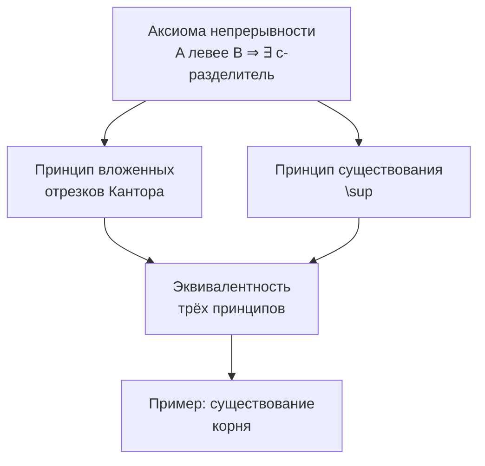
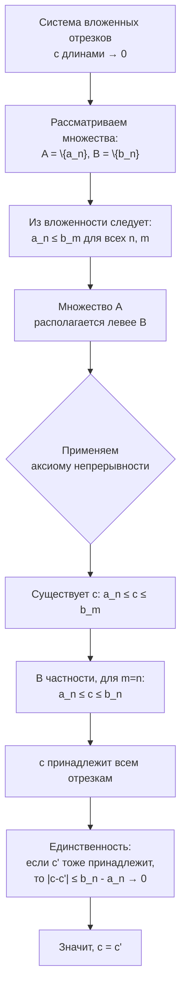
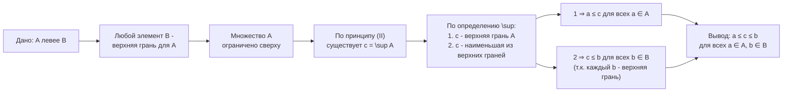
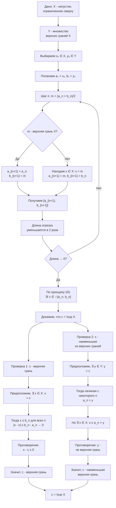
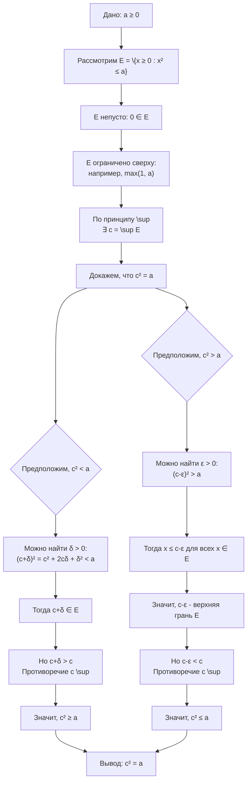

Этот конспект показывает, что разные интуитивные представления о полноте вещественной прямой — это одно и то же свойство, выраженное в разных формах.

---

#### **1. Теорема Кантора о вложенных отрезках**

**Теорема (Кантора):**
*Для любой системы вложенных отрезков ${[a_n, b_n]}$ (т.е. $[a_1, b_1] ⊃ [a_2, b_2] ⊃ ...$), у которых длины $b_n - a_n → 0$ при $n → ∞$, существует единственная точка $c ∈ R$, принадлежащая всем отрезкам системы.*

**Доказательство:**
1.  **Логическая схема доказательства:**

2.  **Доказательство:**
    *   **Существование:**
        Рассмотрим множества $A = \{a_n\}$ (левые концы) и $B = \{b_n\}$ (правые концы). Из вложенности отрезков следует, что для любых $n, m ∈ N$ выполняется $a_n ≤ b_m$ (любой левый конец лежит левее любого правого). Значит, $A$ располагается левее $B$.
        По **аксиоме непрерывности** существует число $c ∈ R$ такое, что $a_n ≤ c ≤ b_m$ для всех $n, m$.
        В частности, при $m = n$ получаем $a_n ≤ c ≤ b_n$ для всех $n$, то есть $c$ принадлежит каждому отрезку $[a_n, b_n]$.
    *   **Единственность:**
        Предположим, есть другая точка $c'$, также принадлежащая всем отрезкам. Тогда для любого $n$ верно: $|c - c'| ≤ b_n - a_n$. Поскольку $b_n - a_n → 0$, единственное неотрицательное число, которое меньше любой сколь угодно малой положительной величины — это ноль. Значит, $|c - c'| = 0$, откуда $c = c'$. ∎

---

#### **2. Эквивалентность трёх формулировок непрерывности**

Докажем, что следующие три утверждения эквивалентны:
1.  **(I) Аксиома непрерывности**: $∀ A, B ⊂ R, A ≠ ∅, B ≠ ∅: (A \text{ левее } B) ⇒ ∃ c ∈ R: a ≤ c ≤ b, ∀ a ∈ A, b ∈ B.$
2.  **(II) Принцип супремума**: Всякое непустое ограниченное сверху множество имеет точную верхнюю грань.
3.  **(III) Принцип Кантора**: Для любой системы вложенных отрезков с длинами, стремящимися к нулю, существует единственная общая точка.

**Доказательство эквивалентности:**

Мы уже знаем:
*   **$(I) ⇒ (II)$** (доказано в Конспекте 1 как теорема о существовании \sup).
*   **$(I) ⇒ (III)$** (только что доказанная теорема Кантора).

Осталось доказать **$(II) ⇒ (I)$** и **$(III) ⇒ (II)$**, чтобы цепочка замкнулась.

**Доказательство $(II) ⇒ (I)$:**

1.  **Логическая схема доказательства:**

2.  **Доказательство:**
    Пусть верен принцип супремума $(II)$. Возьмём множества $A$ и $B$, где $A$ левее $B$. Тогда любой элемент $b ∈ B$ является верхней гранью для $A$. Значит, $A$ ограничено сверху. По принципу $(II)$ существует $c = \sup A$.
    По определению точной верхней грани:
    *   $c$ — верхняя грань $A$ ⇒ $a ≤ c$ для всех $a ∈ A$.
    *   $c$ — наименьшая верхняя грань ⇒ $c ≤ b$ для всех $b ∈ B$ (так как каждый $b$ — верхняя грань).
    Получаем $a ≤ c ≤ b$ для всех $a ∈ A, b ∈ B$, что и есть утверждение $(I)$. ∎

**Доказательство $(III) ⇒ (II)$:**

1.  **Логическая схема доказательства:**

2.  **Доказательство:**
    Пусть верен принцип Кантора $(III)$. Возьмём непустое ограниченное сверху множество $X$. Пусть $Y$ — множество всех верхних граней $X$ (оно непусто). Выберем $x₀ ∈ X$ и $y₀ ∈ Y$. Положим $a₁ = x₀$, $b₁ = y₀$.
    Будем строить систему вложенных отрезков методом деления пополам:
    *   На шаге $n$ имеем отрезок $[a_n, b_n]$, где $a_n$ не является верхней гранью $X$ (есть элемент $X$ ≥ $a_n$), а $b_n ∈ Y$.
    *   Пусть $m = (a_n + b_n)/2$.
        *   Если $m$ — верхняя грань $X$, то положим $a_{n+1} = a_n$, $b_{n+1} = m$.
        *   Если $m$ не является верхней гранью, то найдётся $x ∈ X$ такой, что $x > m$. Положим $a_{n+1} = m$, $b_{n+1} = b_n$.
    *   В любом случае длина отрезка уменьшается в 2 раза: $b_{n+1} - a_{n+1} ≤ (b_n - a_n)/2$. Значит, $b_n - a_n → 0$.

    По принципу Кантора $(III)$ существует единственная точка $c$, принадлежащая всем отрезкам $[a_n, b_n]$. Докажем, что $c = \sup X$.
    *   **$c$ — верхняя грань $X$:** Предположим, что существует $x ∈ X$ такой, что $x > c$. Так как $b_n$ — верхние грани, то $x ≤ b_n$. Тогда $0 < x - c ≤ b_n - a_n → 0$ → противоречие. Значит, $x ≤ c$ для всех $x ∈ X$.
    *   **$c$ — наименьшая верхняя грань:** Предположим, что существует верхняя грань $y ∈ Y$ такая, что $y < c$. Так как $a_n → c$ и $c > y$, то начиная с некоторого $n$ будет $a_n > y$. Но по построению для $a_n$ существует элемент $x ∈ X$ такой, что $x ≥ a_n > y$. Значит, $y$ не является верхней гранью — противоречие. ∎

Теперь цепочка эквивалентности замкнута: $(I) ⇔ (II)$ и $(I) ⇔ (III)$.

---

#### **3. Пример применения: Существование квадратного корня**

**Теорема:** Для любого $a ≥ 0$ существует единственное число $x ≥ 0$ такое, что $x² = a$.

**Доказательство (с использованием принципа супремума):**
1.  **Логическая схема доказательства:**

2.  **Доказательство:**
    Пусть $a ≥ 0$. Рассмотрим множество $E = \{ x ∈ R : x ≥ 0, x² ≤ a \}$.
    *   $E$ непусто ($0 ∈ E$) и ограничено сверху (например, числом $max(1, a)$).
    *   По принципу супремума существует $c = \sup E$.
    *   Докажем, что $c² = a$ от противного.
        *   Если $c² < a$, то можно подобрать $δ > 0$ так, что $(c + δ)² < a$ (например, $δ = (a - c²)/(2c + 1)$). Тогда $c + δ ∈ E$, но $c + δ > c$ — противоречие с тем, что $c$ — верхняя грань.
        *   Если $c² > a$, то можно подобрать $ε > 0$ так, что $(c - ε)² > a$. Тогда для всех $x ∈ E$ будет $x² ≤ a < (c - ε)²$ ⇒ $x < c - ε$. Значит, $c - ε$ — верхняя грань $E$, но $c - ε < c$ — противоречие с тем, что $c$ — точная верхняя грань.
    *   Следовательно, $c² = a$. ∎

---

#### **Вопросы для самопроверки (Конспект 2)**

1.  Сформулируйте три эквивалентных принципа непрерывности вещественных чисел.
2.  Докажите, что из принципа Кантора следует принцип супремума (кратко воспроизведите ключевые шаги построения системы отрезков).
3.  Приведите пример системы вложенных отрезков с рациональными концами, пересечение которой пусто. Что это говорит о множестве рациональных чисел?
4.  **На понимание доказательства:** В доказательстве существования корня, почему мы рассматриваем множество $E = \{x ≥ 0 : x² ≤ a\}$, а не ${x ≥ 0 : x² ≥ a}$?
5.  Докажите, что уравнение $x³ = 3$ имеет решение на отрезке $[1, 2]$, используя метод деления отрезка пополам и принцип Кантора.
***