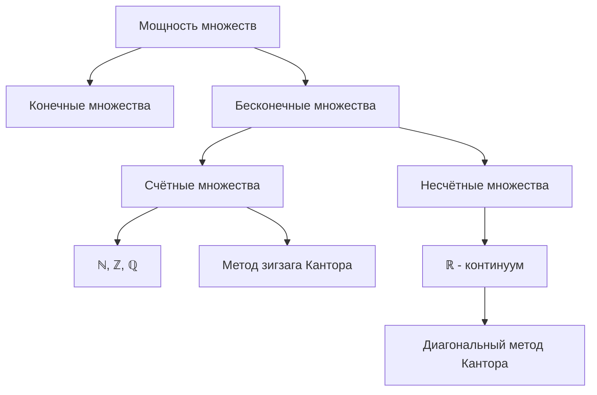

---

### **Конспект 3: Счётность множества рациональных чисел, несчётность множества действительных чисел**

---

## 1. Мощность множеств. Конечные и бесконечные множества

- **Определение:** Два множества $A$ и $B$ называются **равномощными**, если существует биекция $f : A \to B$.  
  **Обозначение:** $|A| = |B|$.

- **Конечное множество:** Множество, равномощное некоторому отрезку натурального ряда $\{1, 2, \dots, n\}$.  
- **Бесконечное множество:** Множество, не являющееся конечным.

- **Счётное множество:** Бесконечное множество, равномощное множеству натуральных чисел $\mathbb{N}$.  
  **Обозначение:** $|A| = \aleph_0$.

---

## 2. Счётность множества рациональных чисел

### 2.1. Счётность $\mathbb{Z}$

Построим биекцию $f : \mathbb{N} \to \mathbb{Z}$:

$$
f(n) = 
\begin{cases}
\frac{n}{2}, & \text{если } n \text{ чётное}, \\
-\frac{n-1}{2}, & \text{если } n \text{ нечётное}.
\end{cases}
$$

**Интуиция:** Мы «перечисляем» целые числа в порядке:  
$0, 1, -1, 2, -2, 3, -3, \dots$

---

### 2.2. Счётность $\mathbb{Q}$

**Теорема:** Множество рациональных чисел $\mathbb{Q}$ счётно.

**Доказательство (метод Кантора):**

1. Рациональные числа можно представить в виде дробей $\frac{p}{q}$, где $p \in \mathbb{Z}$, $q \in \mathbb{N}$, и дробь несократима.
2. Расположим все такие дроби в таблицу:

$$
\begin{array}{cccccc}
\frac{0}{1} & \frac{1}{1} & -\frac{1}{1} & \frac{2}{1} & -\frac{2}{1} & \dots \\
\frac{0}{2} & \frac{1}{2} & -\frac{1}{2} & \frac{2}{2} & -\frac{2}{2} & \dots \\
\frac{0}{3} & \frac{1}{3} & -\frac{1}{3} & \frac{2}{3} & -\frac{2}{3} & \dots \\
\vdots & \vdots & \vdots & \vdots & \vdots & \ddots \\
\end{array}
$$

3. Проходим по таблице «зигзагом» и нумеруем все несократимые дроби.  
   Это даёт биекцию между $\mathbb{N}$ и $\mathbb{Q}$.

**Интуиция:** Хотя рациональных чисел «очень много», их можно занумеровать.

---

## 3. Несчётность множества действительных чисел

### 3.1. Мощность континуума

**Определение:** Множество, равномощное отрезку \([0, 1]\), называется **континуальным**.  
**Обозначение:** $|[0, 1]| = \mathfrak{c}$.

---

### 3.2. Теорема Кантора

**Теорема:** Множество действительных чисел $\mathbb{R}$ несчётно.

**Доказательство (метод диагонали Кантора):**

1. Предположим, что $\mathbb{R}$ счётно. Тогда все числа из \([0, 1]\) можно записать в виде последовательности:  
   $$
   x_1, x_2, x_3, \dots
   $$
2. Запишем каждое число в десятичной системе (бесконечная дробь):  
   $$
   \begin{aligned}
   x_1 &= 0.a_{11}a_{12}a_{13}\dots \\
   x_2 &= 0.a_{21}a_{22}a_{23}\dots \\
   x_3 &= 0.a_{31}a_{32}a_{33}\dots \\
   \vdots
   \end{aligned}
   $$
3. Построим число $y = 0.b_1b_2b_3\dots$, где  
   $$
   b_k = 
   \begin{cases}
   5, & \text{если } a_{kk} \neq 5, \\
   1, & \text{если } a_{kk} = 5.
   \end{cases}
   $$
4. Число $y$ отличается от каждого $x_k$ в $k$-м знаке ⇒ $y \notin \{x_1, x_2, \dots\}$.  
   Противоречие с предположением о счётности.

**Интуиция:** Невозможно «занумеровать» все действительные числа — их «больше», чем натуральных.

---

## 4. Сравнение мощностей

- $|\mathbb{N}| = |\mathbb{Z}| = |\mathbb{Q}| = \aleph_0$ — счётные множества.
- $|\mathbb{R}| = |[0, 1]| = \mathfrak{c}$ — континуум.

**Теорема Кантора:** Для любого множества $A$ выполняется $|A| < |\mathcal{P}(A)|$, где $\mathcal{P}(A)$ — множество всех подмножеств $A$.

**Следствие:** Существуют сколь угодно большие бесконечные мощности.

---

## 5. Вопросы для самопроверки

1. Что означает, что множество счётно? Приведите пример счётного множества, отличного от $\mathbb{N}$.
2. Объясните метод диагонали Кантора. Почему он доказывает несчётность $\mathbb{R}$?
3. Может ли объединение двух счётных множеств быть несчётным? Ответ обоснуйте.
4. Докажите, что множество всех бесконечных последовательностей из 0 и 1 несчётно.
5. Верно ли, что любое подмножество счётного множества счётно? Если нет, приведите контрпример.
6. Что такое континуум? Приведите пример множества мощности континуума, отличного от $\mathbb{R}$.

---