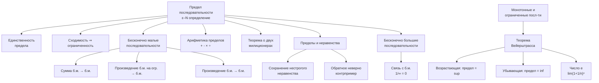
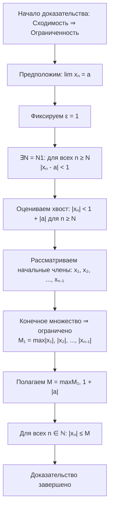
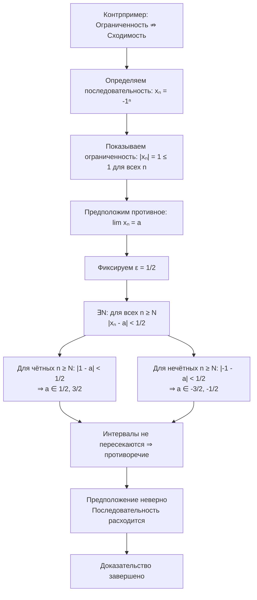
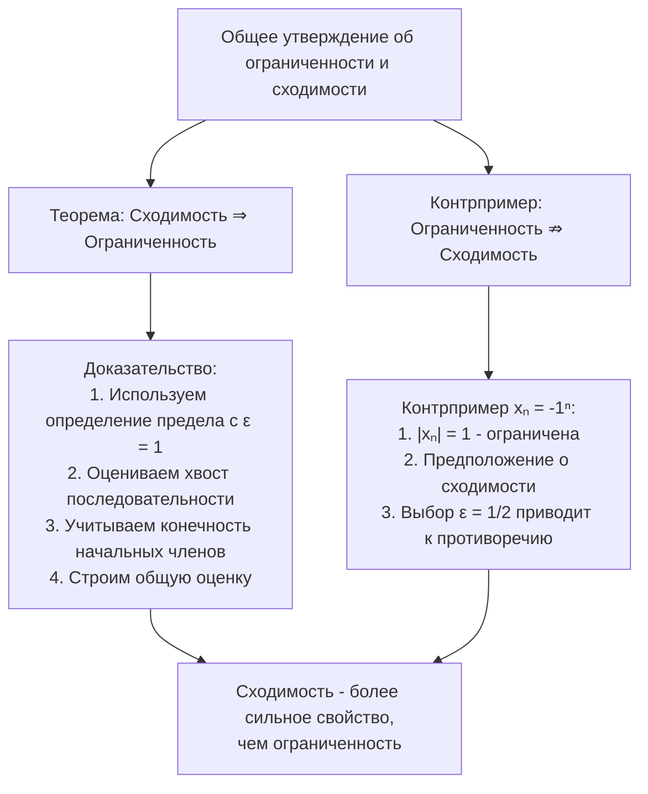
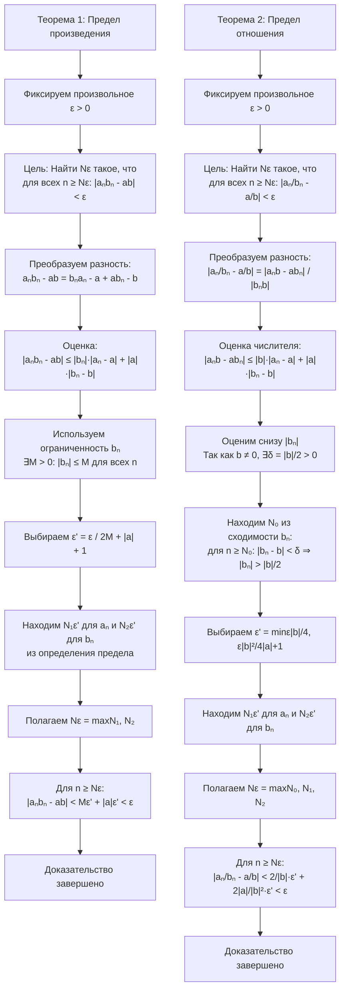

---

## 1. Предел числовой последовательности

### 1.1. Интуитивное представление
Число $a$ называется **пределом последовательности** $\{x_n\}$, если с ростом номера $n$ члены $x_n$ неограниченно приближаются к $a$.  
**Обозначение:** $\lim_{n \to \infty} x_n = a$ или $x_n \to a$.

### 1.2. Строгое определение (ε–N-формализм)
Число $a \in \mathbb{R}$ называется пределом последовательности $\{x_n\}$, если:
$$
\forall \varepsilon > 0 \; \exists N(\varepsilon) \in \mathbb{N} : \forall n \geq N(\varepsilon) \Rightarrow |x_n - a| < \varepsilon.
$$

---

## 2. Единственность предела

**Теорема:** Если последовательность имеет предел, то он единственный.

**Доказательство (от противного):**
1. Предположим, $\lim x_n = a$ и $\lim x_n = b$, где $a \neq b$. Пусть $\varepsilon = \frac{|a-b|}{3} > 0$.
2. По определению:
   - $\exists N_1: \forall n \geq N_1 \Rightarrow |x_n - a| < \varepsilon$
   - $\exists N_2: \forall n \geq N_2 \Rightarrow |x_n - b| < \varepsilon$
1. Возьмём $n \geq \max(N_1, N_2)$. Тогда:
   $$
   |a-b| \leq |a - x_n| + |x_n - b| < \varepsilon + \varepsilon = 2\varepsilon = \frac{2}{3}|a-b| < |a-b|
   $$
   Противоречие. Значит, $a = b$.

---
### Теорема (Сходимость ⇒ ограниченность)
Если последовательность $\{x_n\}$ сходится, то она ограничена.
#### Доказательство:

Пусть $\lim\limits_{n \to \infty} x_n = a$. По определению предела:

Для $\varepsilon = 1$ существует номер $N = N(1) \in \mathbb{N}$ такой, что для всех $n \geq N$ выполняется:
$$
|x_n - a| < 1.
$$

Используя неравенство треугольника, получаем:
$$
|x_n| = |x_n - a + a| \leq |x_n - a| + |a| < 1 + |a| \quad \text{для всех } n \geq N.
$$

Теперь рассмотрим конечное множество первых $N-1$ членов: $\{x_1, x_2, \dots, x_{N-1}\}$. Оно ограничено, так как является конечным. Пусть
$$
M_1 = \max\{|x_1|, |x_2|, \dots, |x_{N-1}|\}.
$$

Положим $M = \max\{M_1, 1 + |a|\}$. Тогда для любого $n \in \mathbb{N}$:
- Если $n < N$, то $|x_n| \leq M_1 \leq M$.
- Если $n \geq N$, то $|x_n| < 1 + |a| \leq M$.

Следовательно, $|x_n| \leq M$ для всех $n \in \mathbb{N}$, что означает ограниченность последовательности. ∎

### Контрпример (Ограниченность ⇏ сходимость)
Последовательность $x_n = (-1)^n$ ограничена, но не сходится.
#### Доказательство:

1. **Ограниченность:** $|x_n| = |(-1)^n| = 1 \leq 1$ для всех $n \in \mathbb{N}$.

2. **Расходимость:** Предположим, что $\lim\limits_{n \to \infty} (-1)^n = a$. Тогда для $\varepsilon = \frac{1}{2}$ существует $N = N(\varepsilon)$ такое, что для всех $n \geq N$:
   $$
   |(-1)^n - a| < \frac{1}{2}.
   $$
   
   Рассмотрим:
   - Для чётных $n = 2k \geq N$: $|1 - a| < \frac{1}{2} \Rightarrow a \in (\frac{1}{2}, \frac{3}{2})$
   - Для нечётных $n = 2k+1 \geq N$: $|-1 - a| < \frac{1}{2} \Rightarrow a \in (-\frac{3}{2}, -\frac{1}{2})$
   
   Эти интервалы не пересекаются — противоречие. Следовательно, последовательность расходится. ∎
### Блок-схема общего утверждения

## 3. Бесконечно малые последовательности

### 3.1. Определение
Последовательность $\{\alpha_n\}$ называется **бесконечно малой**, если $\lim_{n \to \infty} \alpha_n = 0$.

### 3.2. Свойства с доказательствами

**1. Сумма конечного числа бесконечно малых — бесконечно малая.**

**Доказательство:**
Пусть $\{\alpha_n^{(1)}\}, \{\alpha_n^{(2)}\}, \dots, \{\alpha_n^{(k)}\}$ — бесконечно малые.
Зафиксируем $\varepsilon > 0$. Для каждого $i = 1, \dots, k$ найдём $N_i$ такой, что $\forall n \geq N_i \Rightarrow |\alpha_n^{(i)}| < \frac{\varepsilon}{k}$.
Возьмём $N = \max(N_1, \dots, N_k)$. Тогда для $n \geq N$:
$$
|\alpha_n^{(1)} + \dots + \alpha_n^{(k)}| \leq |\alpha_n^{(1)}| + \dots + |\alpha_n^{(k)}| < \frac{\varepsilon}{k} + \dots + \frac{\varepsilon}{k} = \varepsilon.
$$

**2. Произведение бесконечно малой на ограниченную последовательность — бесконечно малая.**

**Доказательство:**
Пусть $\{\alpha_n\}$ — б.м., $\{b_n\}$ — ограничена ($|b_n| \leq M$).
Зафиксируем $\varepsilon > 0$. Для $\alpha_n$ найдём $N$ такой, что $\forall n \geq N \Rightarrow |\alpha_n| < \frac{\varepsilon}{M}$.
Тогда для $n \geq N$:
$$
|\alpha_n b_n| = |\alpha_n| \cdot |b_n| < \frac{\varepsilon}{M} \cdot M = \varepsilon.
$$

**3. Произведение двух бесконечно малых — бесконечно малая.**

**Доказательство:**
Пусть $\{\alpha_n\}, \{\beta_n\}$ — б.м.
Зафиксируем $\varepsilon > 0$. Найдём $N_1$ такой, что $\forall n \geq N_1 \Rightarrow |\alpha_n| < \sqrt{\varepsilon}$.
Найдём $N_2$ такой, что $\forall n \geq N_2 \Rightarrow |\beta_n| < \sqrt{\varepsilon}$.
Тогда для $n \geq \max(N_1, N_2)$:
$$
|\alpha_n \beta_n| < \sqrt{\varepsilon} \cdot \sqrt{\varepsilon} = \varepsilon.
$$

---

## 4. Арифметические операции с пределами

**Теорема:** Если $\lim x_n = a$, $\lim y_n = b$, то:
1. $\lim (x_n + y_n) = a + b$
2. $\lim (x_n \cdot y_n) = a \cdot b$
3. Если $b \neq 0$, то $\lim \frac{x_n}{y_n} = \frac{a}{b}$
##### Доказательство для суммы
Зафиксируем $\varepsilon > 0$. Найдём $N_1: \forall n \geq N_1 \Rightarrow |x_n - a| < \frac{\varepsilon}{2}$
Найдём $N_2: \forall n \geq N_2 \Rightarrow |y_n - b| < \frac{\varepsilon}{2}$
Для $n \geq \max(N_1, N_2)$:
$$
|(x_n + y_n) - (a + b)| \leq |x_n - a| + |y_n - b| < \varepsilon
$$
#### Доказательство для произведения и отношения

##### Доказательство для произведения
Пусть $\lim\limits_{n \to \infty} a_n = a$ и $\lim\limits_{n \to \infty} b_n = b$. Тогда $\lim\limits_{n \to \infty} (a_n b_n) = ab$.

Зафиксируем произвольное $\varepsilon > 0$. Требуется найти такое $N = N(\varepsilon) \in \mathbb{N}$, что для всех $n \geq N$ выполняется $|a_n b_n - ab| < \varepsilon$.

Преобразуем выражение:
$$
a_n b_n - ab = a_n b_n - a b_n + a b_n - ab = b_n (a_n - a) + a (b_n - b).
$$
Тогда:
$$
|a_n b_n - ab| \leq |b_n| \cdot |a_n - a| + |a| \cdot |b_n - b|.
$$

Поскольку последовательность $\{b_n\}$ сходится, она ограничена: существует $M > 0$ такое, что $|b_n| \leq M$ для всех $n \in \mathbb{N}$.

Из сходимости $\{a_n\}$ и $\{b_n\}$ следует:
- Для $\varepsilon' > 0$ существует $N_1 = N_1(\varepsilon')$ такое, что для всех $n \geq N_1$: $|a_n - a| < \varepsilon'$.
- Для того же $\varepsilon'$ существует $N_2 = N_2(\varepsilon')$ такое, что для всех $n \geq N_2$: $|b_n - b| < \varepsilon'$.

Выберем $\varepsilon'$ так, чтобы:
$$
M \varepsilon' + |a| \varepsilon' \leq \varepsilon.
$$
Например, положим $\varepsilon' = \frac{\varepsilon}{2(M + |a| + 1)}$ (чтобы избежать деления на ноль; если $M + |a| = 0$, то $a = 0$ и $b = 0$, и оценка упрощается). Теперь возьмем $N = \max(N_1, N_2)$. Тогда для всех $n \geq N$:
$$
|a_n b_n - ab| < M \varepsilon' + |a| \varepsilon' \leq (M + |a|) \cdot \frac{\varepsilon}{2(M + |a| + 1)} < \varepsilon.
$$
Таким образом, $\lim\limits_{n \to \infty} (a_n b_n) = ab$. ∎

##### Доказательство для отношения
Пусть $\lim\limits_{n \to \infty} a_n = a$ и $\lim\limits_{n \to \infty} b_n = b$, причём $b \neq 0$. Тогда $\lim\limits_{n \to \infty} \frac{a_n}{b_n} = \frac{a}{b}$.

Зафиксируем $\varepsilon > 0$. Требуется найти $N = N(\varepsilon)$ такое, что для всех $n \geq N$:
$$
\left| \frac{a_n}{b_n} - \frac{a}{b} \right| < \varepsilon.
$$

Преобразуем разность:
$$
\left| \frac{a_n}{b_n} - \frac{a}{b} \right| = \left| \frac{a_n b - a b_n}{b_n b} \right| = \frac{|a_n b - a b_n|}{|b_n| |b|}.
$$
Оценим числитель:
$$
|a_n b - a b_n| \leq |b| |a_n - a| + |a| |b_n - b|.
$$
Таким образом:
$$
\left| \frac{a_n}{b_n} - \frac{a}{b} \right| \leq \frac{|b| |a_n - a| + |a| |b_n - b|}{|b_n| |b|} = \frac{|a_n - a|}{|b_n|} + \frac{|a| |b_n - b|}{|b_n| |b|}.
$$

Так как $b \neq 0$, существует $\delta > 0$ такое, что $|b| > \delta$. Выберем $\delta = \frac{|b|}{2}$. Из сходимости $\{b_n\}$ следует, что существует $N_0 = N_0(\delta)$ такое, что для всех $n \geq N_0$: $|b_n - b| < \frac{|b|}{2}$. Тогда для $n \geq N_0$:
$$
|b_n| \geq |b| - |b_n - b| > |b| - \frac{|b|}{2} = \frac{|b|}{2}.
$$

Для $n \geq N_0$ получаем:
$$
\left| \frac{a_n}{b_n} - \frac{a}{b} \right| < \frac{2}{|b|} |a_n - a| + \frac{2|a|}{|b|^2} |b_n - b|.
$$

Выберем $\varepsilon' > 0$ так, чтобы:
$$
\frac{2}{|b|} \varepsilon' + \frac{2|a|}{|b|^2} \varepsilon' < \varepsilon.
$$
Например, положим:
$$
\varepsilon' = \min\left( \frac{\varepsilon |b|}{4}, \frac{\varepsilon |b|^2}{4(|a| + 1)} \right).
$$

Из сходимости $\{a_n\}$ и $\{b_n\}$:
- Существует $N_1 = N_1(\varepsilon')$ такое, что для $n \geq N_1$: $|a_n - a| < \varepsilon'$.
- Существует $N_2 = N_2(\varepsilon')$ такое, что для $n \geq N_2$: $|b_n - b| < \varepsilon'$.

Возьмём $N = \max(N_0, N_1, N_2)$. Тогда для всех $n \geq N$:
$$
\left| \frac{a_n}{b_n} - \frac{a}{b} \right| < \frac{2}{|b|} \varepsilon' + \frac{2|a|}{|b|^2} \varepsilon' \leq \frac{2}{|b|} \cdot \frac{\varepsilon |b|}{4} + \frac{2|a|}{|b|^2} \cdot \frac{\varepsilon |b|^2}{4(|a| + 1)} = \frac{\varepsilon}{2} + \frac{|a| \varepsilon}{2(|a| + 1)} < \varepsilon.
$$
Следовательно, $\lim\limits_{n \to \infty} \frac{a_n}{b_n} = \frac{a}{b}$. ∎

---
## 5. Пределы и неравенства

### 5.1. Теорема о сохранении нестрогого неравенства

**Теорема:** Если $x_n \leq y_n$ для всех $n \geq N_0$ и пределы существуют, то $\lim x_n \leq \lim y_n$.

**Доказательство (от противного):**
Пусть $\lim x_n = a$, $\lim y_n = b$. Предположим, что $a > b$.
Возьмём $\varepsilon = \frac{a-b}{2} > 0$. Тогда:
- $\exists N_1: \forall n \geq N_1 \Rightarrow x_n > a - \varepsilon = \frac{a+b}{2}$
- $\exists N_2: \forall n \geq N_2 \Rightarrow y_n < b + \varepsilon = \frac{a+b}{2}$
Для $n \geq \max(N_0, N_1, N_2)$ получаем:
$$
x_n > \frac{a+b}{2} > y_n
$$
что противоречит условию $x_n \leq y_n$.

### 5.2. Обратное утверждение неверно

**Контрпример:** $x_n = \frac{1}{n}$, $y_n = 0$. 
$\lim x_n = 0 \leq 0 = \lim y_n$, но $x_n > y_n$ для всех $n$.

### 5.3. Теорема о двух милиционерах

Если $x_n \leq y_n \leq z_n$ и $\lim x_n = \lim z_n = a$, то $\lim y_n = a$.

**Доказательство:**
Зафиксируем $\varepsilon > 0$. Найдём $N$ такой, что для $n \geq N$:
$$
a - \varepsilon < x_n \leq y_n \leq z_n < a + \varepsilon
$$
Следовательно, $|y_n - a| < \varepsilon$.

---

## 6. Теорема Вейерштрасса о пределе монотонной последовательности

**Теорема:** Всякая монотонная ограниченная последовательность имеет предел. При этом:
- Если последовательность возрастает и ограничена сверху, то её предел равен точной верхней грани: $\lim x_n = \sup \{x_n\}$
- Если последовательность убывает и ограничена снизу, то её предел равен точной нижней грани: $\lim x_n = \inf \{x_n\}$

**Доказательство (для возрастающей ограниченной сверху):**
Пусть $a = \sup \{x_n\}$. Покажем, что $\lim x_n = a$.

1. Так как $a$ — верхняя грань, то $x_n \leq a$ для всех $n$.
2. Так как $a$ — точная верхняя грань, то для любого $\varepsilon > 0$ существует номер $N$ такой, что $x_N > a - \varepsilon$ (иначе $a - \varepsilon$ была бы верхней гранью, что меньше $a$).
3. Из монотонного возрастания следует, что для всех $n \geq N$ выполняется $x_n \geq x_N > a - \varepsilon$.
4. Таким образом, для всех $n \geq N$ имеем:
   $$
   a - \varepsilon < x_n \leq a < a + \varepsilon
   $$
   то есть $|x_n - a| < \varepsilon$.

Следовательно, по определению предела $\lim x_n = a = \sup \{x_n\}$.

**Доказательство (для убывающей ограниченной снизу)** проводится аналогично с заменой sup на inf.

---

## 7. Число $e$

### 7.1. Определение
$$
e = \lim_{n \to \infty} \left(1 + \frac{1}{n}\right)^n
$$

### 7.2. Существование предела
Рассмотрим последовательность $x_n = \left(1 + \frac{1}{n}\right)^n$. Можно доказать, что:
1. Последовательность возрастает (используя неравенство Бернулли)
2. Последовательность ограничена сверху (например, $x_n < 3$)

Так как последовательность монотонно возрастает и ограничена сверху, по теореме Вейерштрасса она имеет предел, который обозначается через $e$.

---

## 8. Бесконечно большие последовательности

### 8.1. Определение
Последовательность $\{x_n\}$ называется **бесконечно большой**, если:
$$
\forall E > 0 \; \exists N(E) : \forall n \geq N \Rightarrow |x_n| > E
$$

### 8.2. Связь с бесконечно малыми
Если $x_n \to \infty$, то $\frac{1}{x_n} \to 0$. Обратное верно, если $x_n$ не обращается в ноль.

---

## 9. Вопросы для самопроверки

1. Докажите, что произведение бесконечно малой на ограниченную последовательность есть бесконечно малая.
2. Приведите пример, когда $x_n < y_n$, но $\lim x_n = \lim y_n$.
3. Докажите, что если $x_n \to a$ и $x_n \geq 0$, то $a \geq 0$.
4. Верно ли, что из $\lim x_n > \lim y_n$ следует $x_n > y_n$ для всех достаточно больших $n$?
5. Докажите теорему о двух милиционерах.
6. Объясните, почему последовательность $\left(1 + \frac{1}{n}\right)^n$ возрастает.
7. Сформулируйте и докажите теорему Вейерштрасса для убывающей ограниченной снизу последовательности.

---