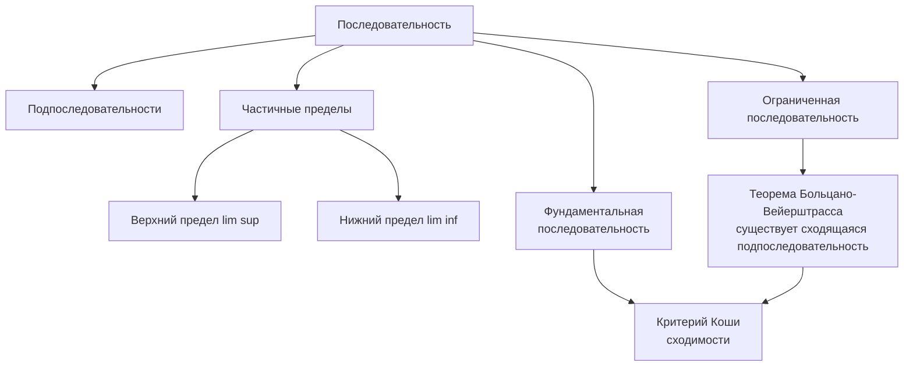
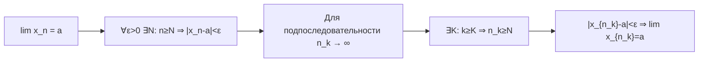
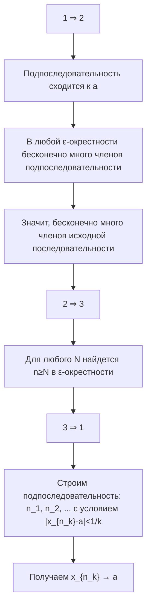
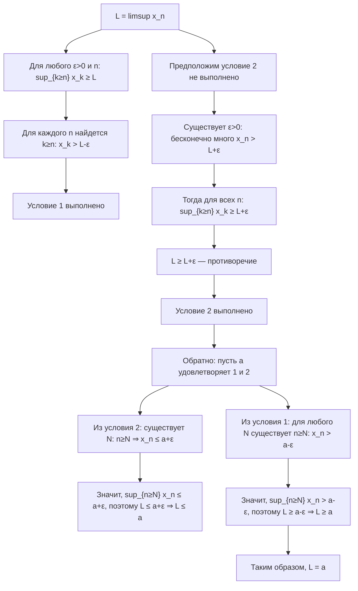
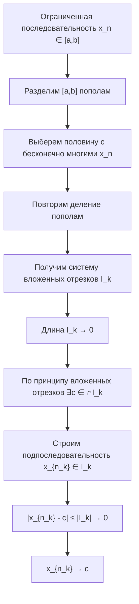
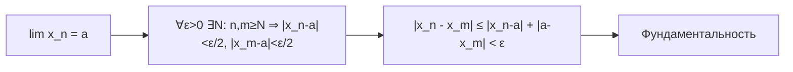
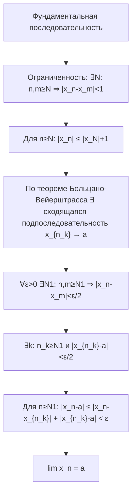

---

## 1. Подпоследовательности

### 1.1. Определение
Пусть задана последовательность $\{x_n\}$ и строго возрастающая последовательность натуральных чисел $n_1 < n_2 < n_3 < \dots$. Тогда последовательность $\{x_{n_k}\}$ называется **подпоследовательностью** последовательности $\{x_n\}$.

**Обозначение:** $\{x_{n_k}\} \subset \{x_n\}$

### 1.2. Связь с пределом исходной последовательности
- Если $\lim_{n \to \infty} x_n = a$, то любая подпоследовательность $\{x_{n_k}\}$ также сходится к $a$.
- Если последовательность неограничена, то существует подпоследовательность, стремящаяся к $+\infty$ или $-\infty$.

**Доказательство первого утверждения:**

**Формальное доказательство:**
Пусть $\lim x_n = a$. Тогда для любого $\varepsilon > 0$ существует $N$ такой, что для всех $n \geq N$ выполняется $|x_n - a| < \varepsilon$.
Поскольку $n_k \to \infty$ при $k \to \infty$, найдётся $K$ такой, что для всех $k \geq K$ выполняется $n_k \geq N$.
Тогда для $k \geq K$ имеем $|x_{n_k} - a| < \varepsilon$. Следовательно, $\lim x_{n_k} = a$.

**Доказательство второго утверждения:**
Если последовательность неограничена сверху, то для любого $M > 0$ существует бесконечно много членов таких, что $x_n > M$. Выбирая $M = 1, 2, 3, \dots$, можно построить подпоследовательность, стремящуюся к $+\infty$. Аналогично для неограниченности снизу.

---

## 2. Частичные пределы

### 2.1. Определение
Число $a \in \mathbb{R}$ называется **частичным пределом** последовательности $\{x_n\}$, если существует подпоследовательность $\{x_{n_k}\}$, сходящаяся к $a$.

### 2.2. Три эквивалентные характеристики частичного предела
Для числа $a \in \mathbb{R}$ следующие условия эквивалентны:
1. $a$ — частичный предел последовательности $\{x_n\}$
2. В любой ε-окрестности точки $a$ содержится бесконечно много членов последовательности
3. Для любого ε > 0 и для любого N существует n ≥ N такое, что $|x_n - a| < ε$

**Доказательство эквивалентности:**

**Формальное доказательство:**
- **(1) ⇒ (2):** Если $a$ — частичный предел, то существует подпоследовательность $x_{n_k} \to a$. Для любого ε > 0 найдется K такое, что для всех k ≥ K выполняется $|x_{n_k} - a| < ε$. Таким образом, в ε-окрестности точки a содержится бесконечно много членов подпоследовательности, а значит и исходной последовательности.
- **(2) ⇒ (3):** Если в любой ε-окрестности точки a содержится бесконечно много членов последовательности, то для любого N найдется n ≥ N такое, что $x_n$ попадает в эту окрестность.
- **(3) ⇒ (1):** Построим подпоследовательность, сходящуюся к a. Возьмем ε₁ = 1. Найдем n₁ такое, что $|x_{n₁} - a| < 1$. Затем возьмем ε₂ = 1/2. Найдем n₂ > n₁ такое, что $|x_{n₂} - a| < 1/2$. Продолжая этот процесс, получим подпоследовательность $x_{n_k}$, для которой $|x_{n_k} - a| < 1/k \to 0$, значит $x_{n_k} \to a$.

---

## 3. Верхний и нижний пределы

### 3.1. Определения через супремумы и инфимумы
- **Верхний предел** последовательности $\{x_n\}$:
  $$
  \limsup_{n \to \infty} x_n = \inf_{n \geq 1} \sup_{k \geq n} x_k
  $$
- **Нижний предел** последовательности $\{x_n\}$:
  $$
  \liminf_{n \to \infty} x_n = \sup_{n \geq 1} \inf_{k \geq n} x_k
  $$

### 3.2. Эквивалентные характеристики
Число $a$ является верхним пределом последовательности $\{x_n\}$ тогда и только тогда, когда:
1. Для любого $\varepsilon > 0$ существует бесконечно много номеров $n$ таких, что $x_n > a - \varepsilon$
2. Для любого $\varepsilon > 0$ существует лишь конечное число номеров $n$ таких, что $x_n > a + \varepsilon$

**Доказательство эквивалентности определений:**

**Формальное доказательство:**

Пусть $L = \limsup x_n = \inf_{n} \sup_{k \geq n} x_k$.

- **Покажем, что L удовлетворяет условиям 1 и 2:**
  - Для любого ε > 0 и для любого n имеем $\sup_{k \geq n} x_k \geq L$. Значит, для каждого n найдется k ≥ n такое, что $x_k > L - ε$. Таким образом, условие 1 выполнено.
  - Предположим, что условие 2 не выполнено. Тогда существует ε > 0 такое, что бесконечно много x_n > L + ε. Но тогда для всех n будет $\sup_{k \geq n} x_k \geq L + ε$, значит $L = \inf_{n} \sup_{k \geq n} x_k \geq L + ε$ — противоречие.

- **Теперь докажем обратное:** пусть число a удовлетворяет условиям 1 и 2. Покажем, что a = L.
  - Из условия 2 следует, что для любого ε > 0 существует N такое, что для всех n ≥ N выполняется x_n ≤ a + ε. Значит, $\sup_{n \geq N} x_n \leq a + ε$, поэтому L ≤ a + ε. Так как ε произвольно, то L ≤ a.
  - Из условия 1 следует, что для любого ε > 0 и для любого N существует n ≥ N такое, что x_n > a - ε. Значит, $\sup_{n \geq N} x_n > a - ε$, поэтому L ≥ a - ε. Так как ε произвольно, то L ≥ a.
  - Таким образом, L = a.

---

## 4. Теорема Больцано-Вейерштрасса

**Теорема:** Всякая ограниченная последовательность имеет сходящуюся подпоследовательность.

**Доказательство (метод деления отрезка пополам):**

**Формальное доказательство:**
1. Пусть последовательность $\{x_n\}$ ограничена: $a \leq x_n \leq b$ для всех $n$. Рассмотрим отрезок $I_0 = [a, b]$.
2. Разделим $I_0$ пополам. Хотя бы в одной из половин содержится бесконечно много членов последовательности. Выберем эту половину и обозначим её $I_1$.
3. Продолжим процесс: на $k$-м шаге имеем отрезок $I_k$, содержащий бесконечно много членов последовательности. Разделим его пополам и выберем половину $I_{k+1}$, содержащую бесконечно много членов.
4. Длина отрезков $I_k$ стремится к нулю: $|I_k| = \frac{b-a}{2^k} \to 0$.
5. По принципу вложенных отрезков существует единственная точка $c$, принадлежащая всем отрезкам $I_k$.
6. Построим подпоследовательность, сходящуюся к $c$:
   - Выберем $n_1$ такой, что $x_{n_1} \in I_1$
   - Выберем $n_2 > n_1$ такой, что $x_{n_2} \in I_2$
   - Продолжая, получим подпоследовательность $\{x_{n_k}\}$, где $x_{n_k} \in I_k$
   - Так как $|x_{n_k} - c| \leq |I_k| \to 0$, то $x_{n_k} \to c$

---

## 5. Критерий Коши сходимости числовой последовательности

### 5.1. Фундаментальная последовательность
Последовательность $\{x_n\}$ называется **фундаментальной** (или последовательностью Коши), если:
$$
\forall \varepsilon > 0 \; \exists N(\varepsilon) \in \mathbb{N} : \forall n, m \geq N(\varepsilon) \Rightarrow |x_n - x_m| < \varepsilon
$$

### 5.2. Критерий Коши
Последовательность сходится тогда и только тогда, когда она фундаментальна.

**Доказательство необходимости (⇒):**

**Формальное доказательство необходимости:**
Если $\lim x_n = a$, то для $\varepsilon > 0$ найдётся $N$ такой, что для всех $n, m \geq N$ выполняется:
$$
|x_n - a| < \frac{\varepsilon}{2}, \quad |x_m - a| < \frac{\varepsilon}{2}
$$
Тогда $|x_n - x_m| \leq |x_n - a| + |a - x_m| < \varepsilon$. Следовательно, последовательность фундаментальна.

**Доказательство достаточности (⇐):**

**Формальное доказательство достаточности:**
1. Покажем, что фундаментальная последовательность ограничена. При $\varepsilon = 1$ найдётся $N$ такой, что для всех $n, m \geq N$ выполняется $|x_n - x_m| < 1$. Тогда для $n \geq N$ имеем:
   $$
   |x_n| \leq |x_N| + |x_n - x_N| < |x_N| + 1
   $$
   Значит, последовательность ограничена.
2. По теореме Больцано-Вейерштрасса существует сходящаяся подпоследовательность $\{x_{n_k}\} \to a$.
3. Покажем, что вся последовательность сходится к $a$. Для $\varepsilon > 0$ найдём $N$ такой, что:
   - Для всех $n, m \geq N$ выполняется $|x_n - x_m| < \frac{\varepsilon}{2}$ (фундаментальность)
   - Найдём $k$ такой, что $n_k \geq N$ и $|x_{n_k} - a| < \frac{\varepsilon}{2}$
   Тогда для всех $n \geq N$:
   $$
   |x_n - a| \leq |x_n - x_{n_k}| + |x_{n_k} - a| < \frac{\varepsilon}{2} + \frac{\varepsilon}{2} = \varepsilon
   $$
   Следовательно, $\lim x_n = a$.

---

## 6. Вопросы для самопроверки

1. Дайте определение подпоследовательности. Докажите, что если последовательность сходится, то любая её подпоследовательность сходится к тому же пределу.
2. Что такое частичный предел? Сформулируйте и докажите три эквивалентных определения частичного предела.
3. Докажите, что для любой последовательности верхний предел равен наибольшему частичному пределу, а нижний предел - наименьшему.
4. Докажите теорему Больцано-Вейерштрасса методом деления отрезка пополам.
5. Что такое фундаментальная последовательность? Докажите критерий Коши сходимости последовательности.
6. Верно ли, что если последовательность фундаментальна, то она ограничена? Докажите.
7. Пусть $\{x_n\}$ — ограниченная последовательность. Докажите, что её верхний предел является наибольшим частичным пределом.
8. Приведите пример последовательности, у которой множество частичных пределов совпадает с отрезком [0,1].

---