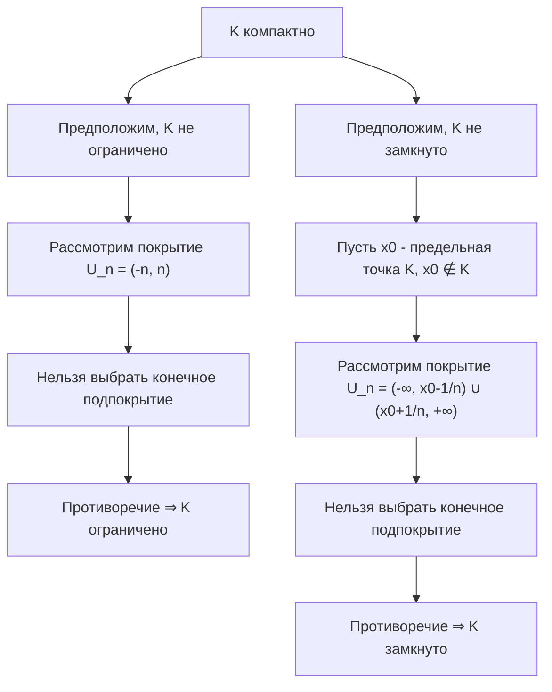
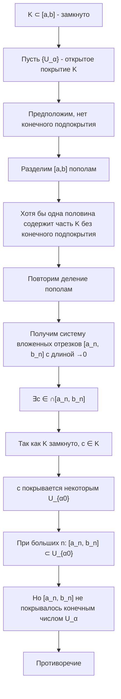
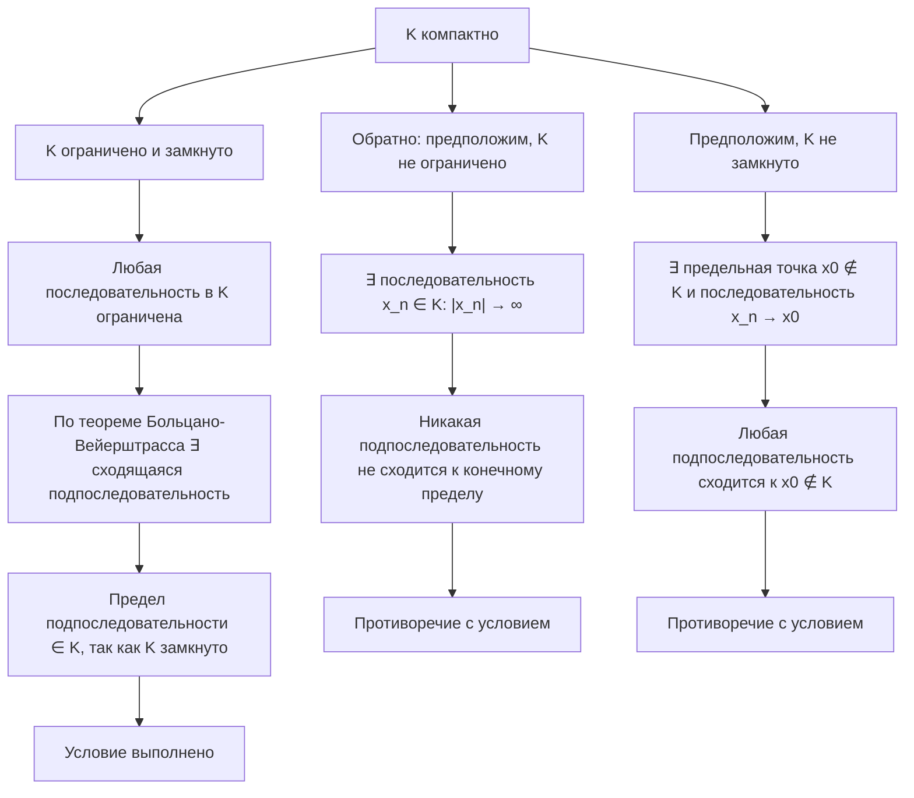

## 1. Топология числовой прямой

### 1.1. Основные определения

**Окрестность точки:** Множество $U \subset \mathbb{R}$ называется окрестностью точки $x_0 \in \mathbb{R}$, если существует $\varepsilon > 0$ такое, что $(x_0 - \varepsilon, x_0 + \varepsilon) \subset U$.

**Внутренняя точка:** Точка $x_0$ называется внутренней точкой множества $A \subset \mathbb{R}$, если существует окрестность $U$ точки $x_0$, целиком содержащаяся в $A$.

**Предельная точка:** Точка $x_0$ называется предельной точкой множества $A \subset \mathbb{R}$, если в любой её окрестности содержится хотя бы одна точка из $A$, отличная от $x_0$.

**Изолированная точка:** Точка $x_0 \in A$, не являющаяся предельной точкой $A$.

### 1.2. Открытые и замкнутые множества

**Открытое множество:** Множество, все точки которого внутренние.

**Замкнутое множество:** Множество, содержащее все свои предельные точки.

**Замыкание множества:** Замыканием $\overline{A}$ множества $A$ называется объединение $A$ и множества всех его предельных точек.

---

## 2. Компактность

### 2.1. Определение компактности

Множество $K \subset \mathbb{R}$ называется **компактным**, если из любого его открытого покрытия можно выбрать конечное подпокрытие.

**Открытое покрытие:** Семейство открытых множеств $\{U_\alpha\}$ такое, что $K \subset \bigcup_\alpha U_\alpha$.

### 2.2. Критерий компактности в $\mathbb{R}$

**Теорема:** Множество $K \subset \mathbb{R}$ компактно тогда и только тогда, когда оно ограничено и замкнуто.

**Доказательство необходимости (⇒):**

**Формальное доказательство необходимости:**
1. **Ограниченность:** Предположим, что $K$ не ограничено. Тогда для любого $n \in \mathbb{N}$ существует $x_n \in K$ такой, что $|x_n| > n$. Рассмотрим покрытие $U_n = (-n, n)$. Это открытое покрытие $K$, но из него нельзя выбрать конечное подпокрытие, так как $K$ не ограничено. Противоречие с компактностью.
2. **Замкнутость:** Пусть $x_0$ — предельная точка $K$. Предположим, что $x_0 \notin K$. Рассмотрим открытые множества $U_n = \left(-\infty, x_0 - \frac{1}{n}\right) \cup \left(x_0 + \frac{1}{n}, +\infty\right)$. Они покрывают $K$, но нельзя выбрать конечное подпокрытие, так как в любой окрестности $x_0$ есть точки из $K$. Противоречие.

**Доказательство достаточности (⇐) — лемма Гейне-Бореля:**

---

## 3. Лемма Гейне-Бореля

**Теорема (Гейне-Бореля):** Всякое ограниченное замкнутое множество в $\mathbb{R}$ компактно.

**Доказательство:**

**Формальное доказательство:**
1. Пусть $K \subset [a, b]$ — замкнутое множество, и пусть $\{U_\alpha\}$ — его открытое покрытие.
2. Предположим противное: $K$ не компактно, то есть нельзя выбрать конечное подпокрытие.
3. Разделим отрезок $[a, b]$ пополам. Хотя бы одна из половин содержит часть $K$, которая не покрывается конечным числом $U_\alpha$. Выберем эту половину.
4. Продолжим процесс деления пополам. Получим систему вложенных отрезков $[a_n, b_n]$ с длиной $b_n - a_n \to 0$, каждый из которых содержит точки $K$, не покрываемые конечным числом $U_\alpha$.
5. По принципу вложенных отрезков существует точка $c \in \bigcap [a_n, b_n]$. Так как $K$ замкнуто, то $c \in K$.
6. Точка $c$ покрывается некоторым $U_{\alpha_0}$. Так как $U_{\alpha_0}$ открыто, существует $\varepsilon > 0$ такое, что $(c - \varepsilon, c + \varepsilon) \subset U_{\alpha_0}$.
7. При достаточно больших $n$ будет $[a_n, b_n] \subset (c - \varepsilon, c + \varepsilon) \subset U_{\alpha_0}$. Но это противоречит тому, что отрезок $[a_n, b_n]$ не покрывается конечным числом $U_\alpha$.

---

## 4. Связь с теоремой Больцано-Вейерштрасса

**Теорема:** Множество $K \subset \mathbb{R}$ компактно тогда и только тогда, когда любая последовательность точек из $K$ имеет подпоследовательность, сходящуюся к точке из $K$.

**Доказательство:**

**Формальное доказательство:**
- **Необходимость (⇒):** Пусть $K$ компактно (значит, ограничено и замкнуто). Возьмем любую последовательность $\{x_n\} \subset K$. Так как $K$ ограничено, по теореме Больцано-Вейерштрасса существует сходящаяся подпоследовательность $x_{n_k} \to x_0$. Так как $K$ замкнуто, то $x_0 \in K$.
- **Достаточность (⇐):** Если $K$ не ограничено, то существует последовательность $x_n \in K$ такая, что $|x_n| \to \infty$, и никакая подпоследовательность не сходится к конечному пределу. Если $K$ не замкнуто, то существует предельная точка $x_0 \notin K$ и последовательность $x_n \in K$, сходящаяся к $x_0$. Любая подпоследовательность сходится к $x_0 \notin K$. Противоречие.

---

## 6. Вопросы для самопроверки

1. Дайте определение открытого и замкнутого множества. Приведите пример множества, которое не является ни открытым, ни замкнутым.
2. Что такое предельная точка множества? Докажите, что замыкание множества является наименьшим замкнутым множеством, его содержащим.
3. Сформулируйте и докажите критерий компактности в $\mathbb{R}$.
4. Докажите лемму Гейне-Бореля методом деления отрезка пополам.
5. Как связаны компактность и теорема Больцано-Вейерштрасса? Докажите эквивалентность этих свойств.
6. Приведите пример покрытия отрезка $[0, 1]$ открытыми интервалами, из которого нельзя выбрать конечное подпокрытие. Почему это невозможно?
7. Верно ли, что объединение любого семейства компактных множеств компактно? А пересечение?

---